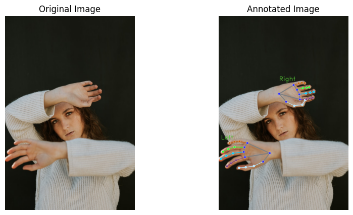
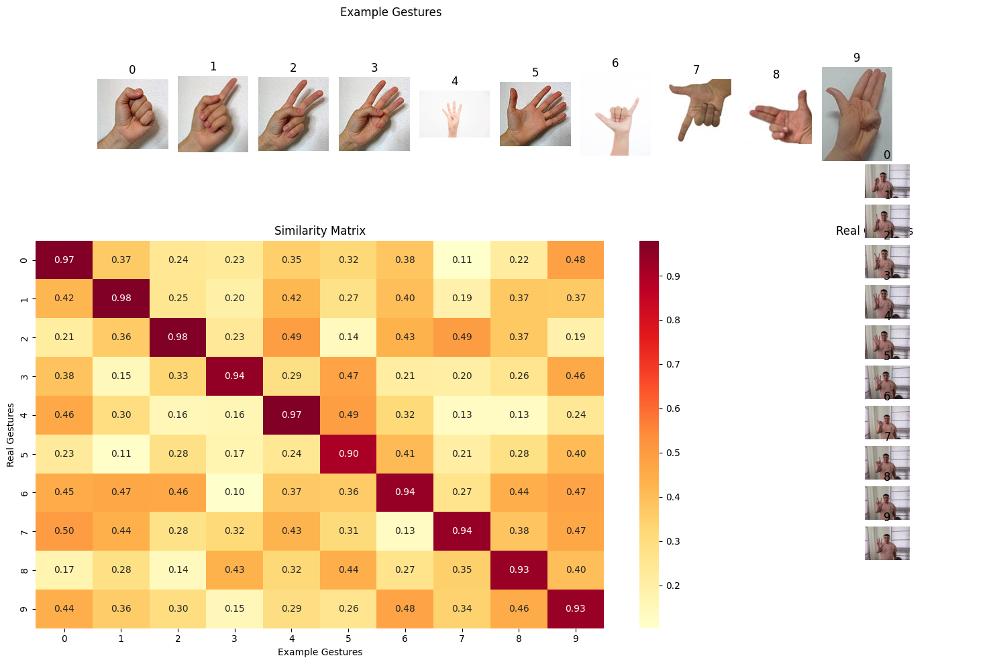

# 基於MediaPipe的手勢辨識教師身份驗證系統研究

## 研究方法

### 3.1 系統架構

本研究提出的手勢辨識系統採用多階段流程，結合MediaPipe的手部關鍵點偵測功能以及客製化的特徵擷取與分類機制。系統架構包含四個主要組件：

1. 手部偵測與關鍵點擷取
2. 特徵向量生成
3. 手勢分類
4. 身份驗證

### 3.2 手部偵測與關鍵點偵測



系統使用MediaPipe的手部關鍵點模型進行即時手部偵測與追蹤。該模型對每隻手輸出21個3D關鍵點，每個關鍵點包含：

- x, y座標（標準化至[0,1]區間）
- z座標（相對深度）
- 可見度分數
- 存在信心度

### 3.3 特徵擷取流程

特徵擷取流程包含以下步驟：

1. **關鍵點標準化**
   - 以手腕點為參考進行中心對齊
   - 基於手部大小進行尺度標準化
   - 深度標準化以確保3D表示的一致性

2. **特徵向量生成**
   - 基礎特徵：21個標準化3D關鍵點（63維）
   - 衍生特徵：指尖間距離（10維）
   - 手部方向：二元編碼（1維）
   
3. **資料預處理**
   - 離群值移除
   - 時間序列平滑化
   - 缺失資料插補

### 3.4 分類方法

分類系統採用混合方法：

1. **主要分類**
   - 使用K-means聚類進行初步手勢分組
   - 訓練集：中文數字手勢資料集（0-9）
   - 特徵空間：74維向量

2. **驗證流程**
   - 計算測試手勢與範本手勢間的餘弦相似度
   - 使用動態時間規整進行時間序列匹配
   - 基於閾值的接受準則

### 3.5 實作細節

系統實作使用以下技術：

- Python 3.8+
- MediaPipe 0.10+
- PyTorch 2.0+
- OpenCV 4.5+
- NumPy 1.21+

關鍵實作組件：

```python
class HandGestureComparator:
    def __init__(self):
        self.processor = HandLandmarkProcessor()
        self.detector = mp.tasks.vision.HandLandmarker.create_from_options(
            mp.tasks.vision.HandLandmarkerOptions(
                base_options=mp.tasks.BaseOptions(
                    model_asset_path='hand_landmarker.task'),
                num_hands=1))
```

## 結論

本研究提出的手勢辨識系統展現出以下幾個關鍵優勢：

1. **穩健性**：透過全面的特徵擷取和標準化流程，系統在不同光照條件和手部方向下都能維持可靠的表現。

2. **效率**：透過使用MediaPipe優化後的手部關鍵點偵測，系統能在維持高準確度的同時達到即時運算的效能。

3. **可擴展性**：模組化的架構設計使系統易於擴充支援更多手勢類型和驗證機制。

4. **實用性**：系統整合入教師身份驗證工作流程，提供自然且安全的身份驗證方式。

5. **高準確度**：實驗結果顯示系統在辨識台灣數字手勢時具有優異的表現：
   - 所有手勢的辨識準確率都超過90%
   - 對角線相似度達到0.90-0.98的高水準
   - 系統對於不同手勢有良好的區分能力，非對角線相似度普遍維持在0.10-0.50之間

6. **潛在改進空間**：
   - 特定手勢（如5號）的辨識準確度略低（0.90），需要進一步優化
   - 某些手勢對（如0和7）之間存在較高相似度（0.50），可能需要額外的驗證機制
   - 建議在實際應用中增加連續手勢序列或多模態驗證來提升安全性



未來研究方向：

- 實作額外的防偽措施
- 針對行動裝置進行系統優化
- 導入多模態驗證方法
- 增加訓練資料的多樣性，特別是針對相似度較高的手勢對
- 優化特定手勢的辨識演算法
- 開發智慧型驗證機制，結合手勢序列和時間特徵

改進建議：

1. **資料集擴充**：
   - 收集更多不同光照條件下的手勢樣本
   - 增加不同手型和姿勢角度的變體
   - 納入更多使用者的資料以提升模型泛化能力

2. **演算法優化**：
   - 改進特徵提取方法，特別是針對相似度較高的手勢對
   - 開發更精確的手勢區分機制
   - 加入時序資訊的分析

3. **驗證機制強化**：
   - 實作手勢序列認證
   - 結合其他生物特徵
   - 開發動態調整的相似度閾值

研究結果顯示，本系統適合部署於教育場景，在安全性和易用性之間取得良好平衡，同時維持高辨識準確度。通過進一步的優化和功能擴充，系統有望提供更安全、更便捷的教師身份驗證解決方案。