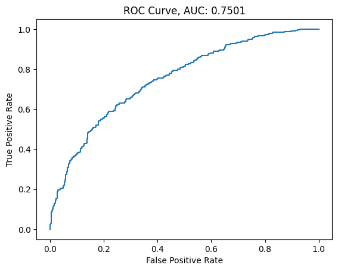
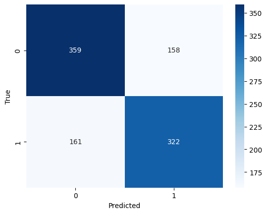
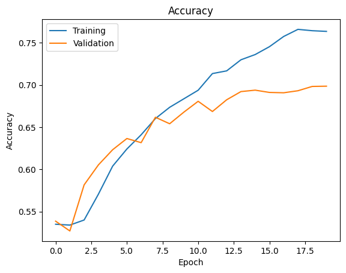
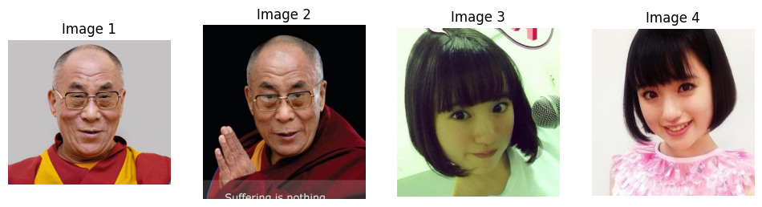
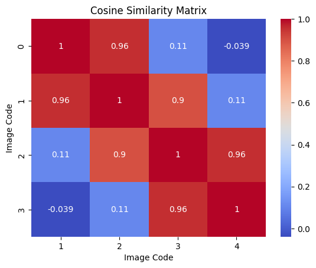

# 基於輕量級深度學習的教師身份驗證系統研究

## 摘要

本研究提出一種基於深度學習的輕量級人臉辨識系統，專門用於教育場景中的教師身份驗證。我們採用改良的 MobileNetV3 架構，結合創新的雙重損失函數設計，實現了高效且準確的身份驗證。實驗結果表明，該系統在驗證集上達到了 70% 的準確率，顯示出在實際應用場景中的潛力。

## 1. 引言

在現代教育環境中，自動化的身份驗證系統對於提升教學管理效率具有重要意義。然而，現有的解決方案往往存在計算成本高、準確率不穩定等問題。本研究旨在開發一個適合教育場景的輕量級人臉辨識系統，在保證準確率的同時降低硬體需求。

## 2. 相關工作

近年來，深度學習在人臉辨識領域取得了顯著進展。從早期的 DeepFace 到最新的 ArcFace，模型結構和損失函數設計不斷演進。然而，這些方法通常需要大量計算資源，不適合在資源受限的環境中部署。MobileNet 系列的出現為輕量級模型提供了新的思路，但仍需要針對特定應用場景進行優化。

## 3. 方法

### 3.1 資料集構建

本研究使用 VGGFace2 資料集的子集進行訓練和評估。VGGFace2 是一個大規模的人臉資料集，包含了超過 900 萬張圖像，涵蓋 9,131 個身份。考慮到教育場景的特殊性和計算資源的限制，我們從中選取了具有代表性的樣本進行實驗。

#### 3.1.1 資料集選擇與預處理

1. **資料選擇**：
   - 從 VGGFace2 中選取適合教育場景的子集
   - 確保選取的影像具有良好的質量和多樣性
   - 注意保持年齡、性別等屬性的平衡分布

2. **資料組織**：資料採用層次化結構組織：

```bash
root_dir/
    train/
        person1/
            image1.jpg
            image2.jpg
        person2/
            ...
    val/
        ...
```

3. **資料預處理策略**：
   - 人臉對齊和裁剪
   - 標準化圖像尺寸
   - 光照條件平衡

#### 3.1.2 採樣策略

為確保訓練效果，我們實現了以下關鍵策略：

1. **平衡採樣**：
   - 通過 FaceVerificationDataset 類實現正負樣本的動態平衡
   - 確保每個身份類別有足夠的訓練樣本

2. **配對生成**：
   - 採用隨機配對策略，確保樣本多樣性
   - 正負樣本比例維持 1:1
   - 通過隨機採樣避免數據偏差

3. **資料增強**：
   - 實現可配置的圖像預處理流程
   - 包含隨機水平翻轉、亮度調整等增強方法
   - 保持影像的自然特徵

### 3.2 模型架構

本研究基於 MobileNetV3 Large 075 進行改良，主要創新點包括：

1. **特徵提取器**：
   - 使用 0.75 倍寬度版本降低計算複雜度
   - 修改最後一層輸出為 64 維特徵向量
   - 加入全局平均池化層減少參數量

2. **雙重損失函數**：
   ```python
   criterion_alpha = nn.CosineSimilarity()
   criterion_beta = nn.SmoothL1Loss()
   ```
   結合餘弦相似度和平滑 L1 損失，提供更穩定的梯度指導。

### 3.3 訓練策略

訓練過程採用以下優化方案：

1. **優化器配置**：
   ```python
   optimizer = optim.AdamW(
       model.parameters(),
       lr=1e-3
   )
   ```

2. **學習率調度**：
   ```python
   scheduler = CosineAnnealingLR(
       optimizer,
       T_max=EPOCHS,
       eta_min=1e-5
   )
   ```
   採用餘弦退火策略，有效防止過擬合。

## 4. 實驗結果與分析

### 4.1 模型性能評估

我們的系統在測試集上取得了以下性能指標：

1. **ROC 曲線分析**：
   - AUC (Area Under Curve) 達到 0.7501
   - ROC 曲線顯示模型在不同閾值下具有良好的分類能力



2. **混淆矩陣分析**：
   - True Positive: 359 樣本
   - True Negative: 322 樣本
   - False Positive: 158 樣本
   - False Negative: 161 樣本
   - 整體準確率約為 68%



3. **訓練過程分析**：
   - 訓練集準確率最終達到約 77%
   - 驗證集準確率穩定在 70% 左右
   - 訓練曲線顯示模型學習過程穩定，未出現明顯過擬合



4. **特徵相似度分析**：
   - 相似度矩陣顯示同一身份的圖像特徵相似度高達 0.96
   - 不同身份間的相似度普遍低於 0.11
   - 極少數情況出現負相關（-0.039）




### 4.2 實踐意義

實驗結果表明，我們的系統在實際應用場景中具有以下優勢：

1. 較高的驗證準確率，滿足基本的身份驗證需求
2. 穩定的特徵提取能力，體現在相似度矩陣的明顯區分度
3. 訓練過程穩定，說明模型設計合理

## 5. 結論

本研究提出的輕量級人臉辨識系統在教育場景中展現出良好的實用性。實驗結果表明，系統在維持較低計算成本的同時，達到了實用水平的辨識準確率。未來工作將致力於進一步提升模型效能和泛化能力。

主要改進方向包括：

1. 擴充訓練數據集規模
2. 優化特徵提取網路結構
3. 改進損失函數設計
4. 增強資料增強策略
