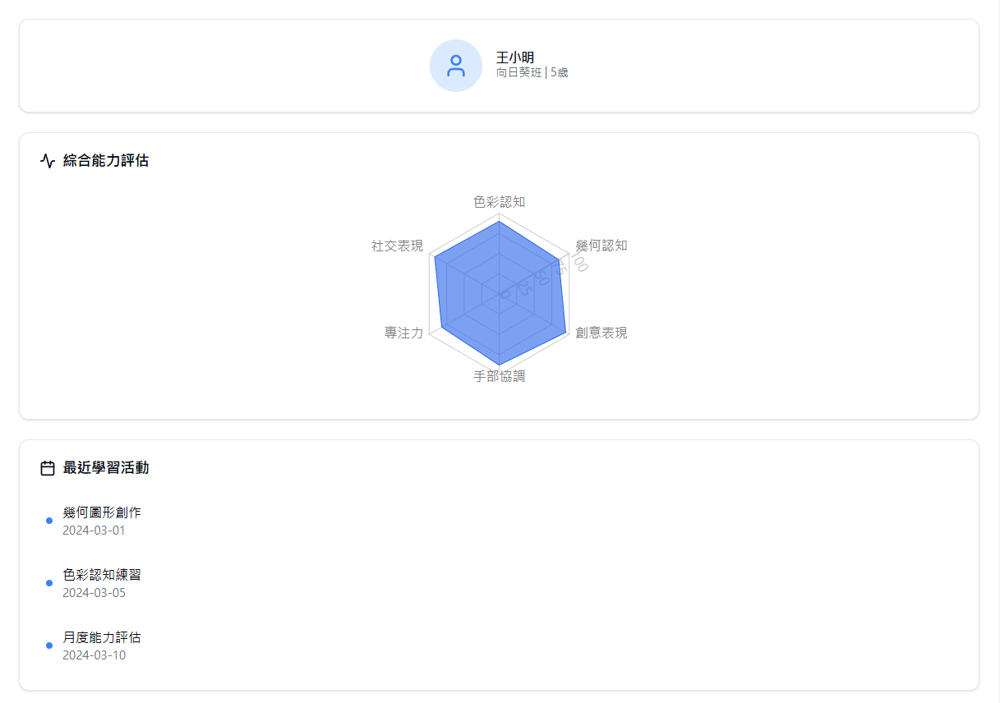
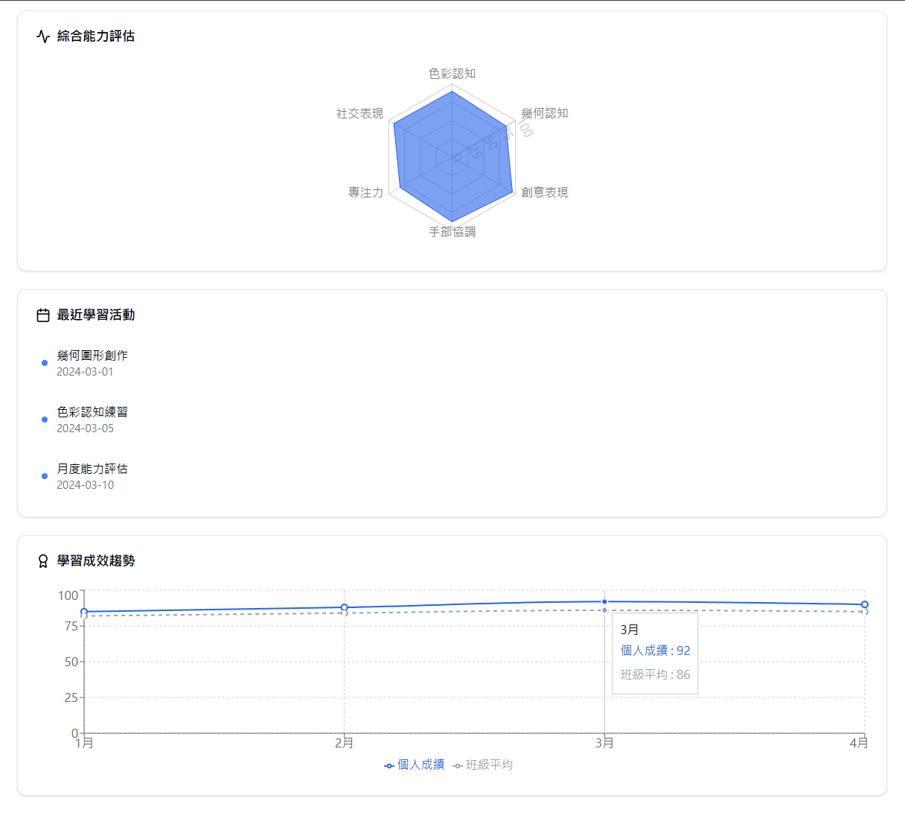
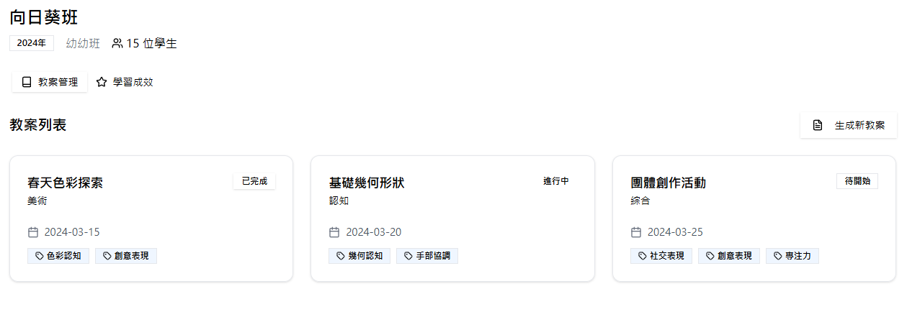
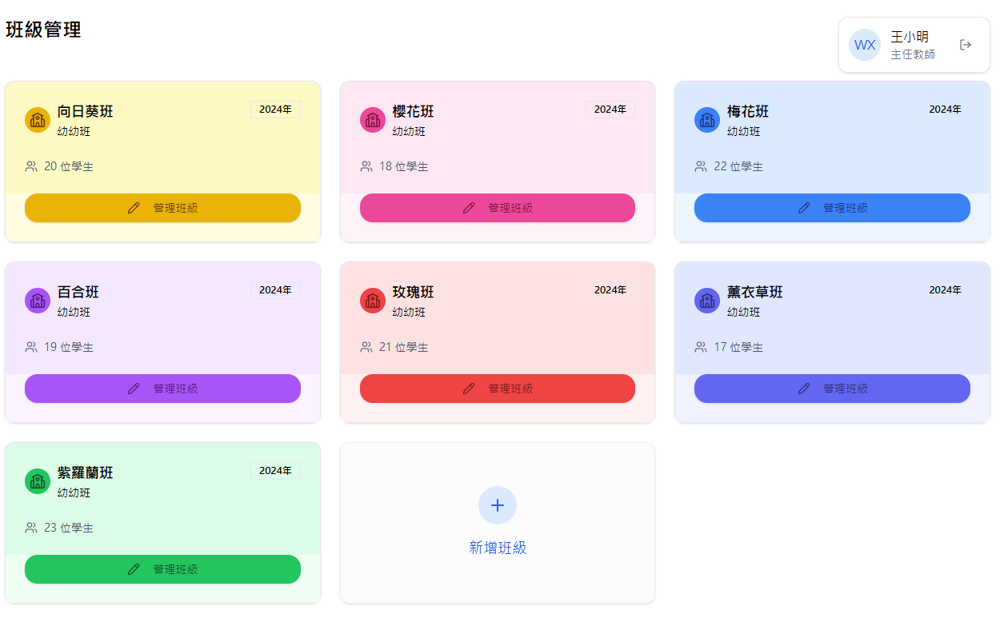
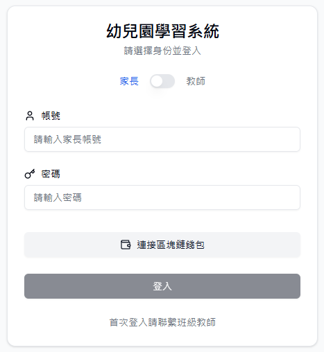
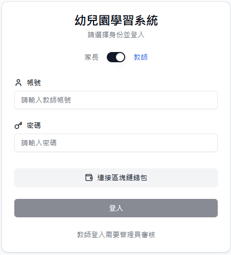

# Report of the project

## 區塊練學習歷程平台

### 1. 技術

- FastAPI (python framework)
- React (javascript framework)
- MongoDB (database)
- TailwindCSS (css framework)

### 2. Demo

- 首頁1

- 首頁2

- 班級管理 (learning metric)

- 班級管理 (teaching case)

- 班級管理 (main page)

- login page (parent)

- login page (teacher)

## 教案生成系統

### 1. 技術

- Ollama
- llama-3.1-70b-versatile

### 2. Demo

#### 教學課程生成

#### 繪圖題目生成

