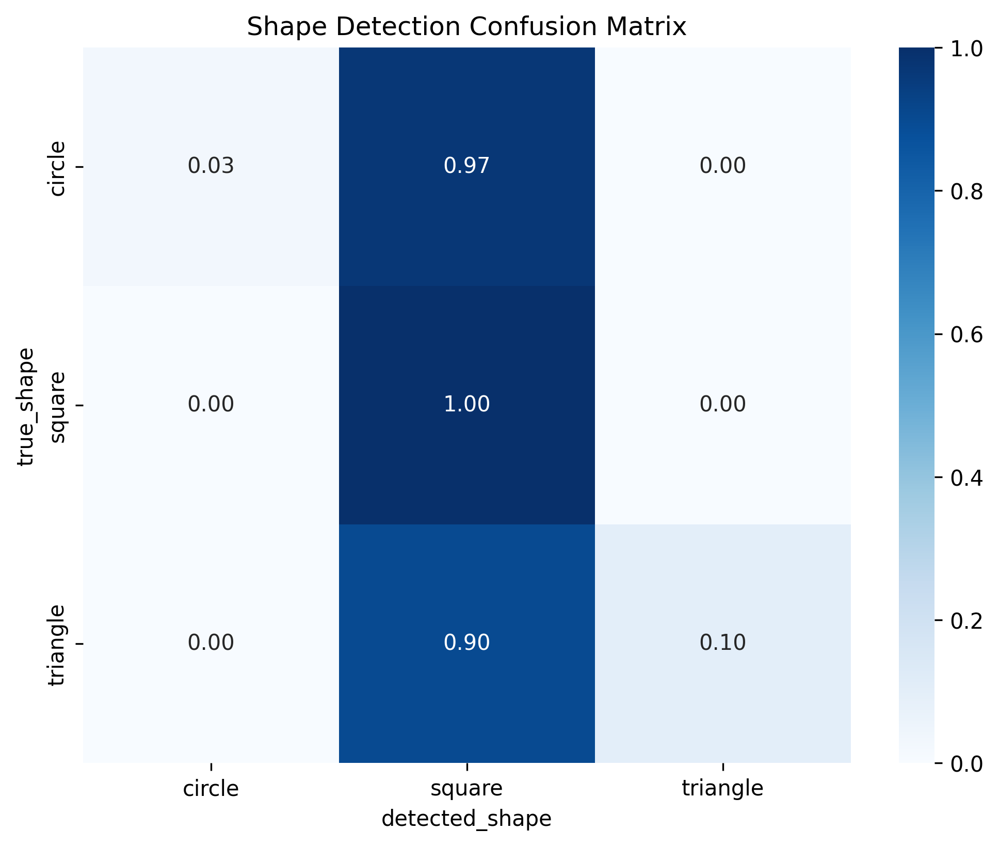
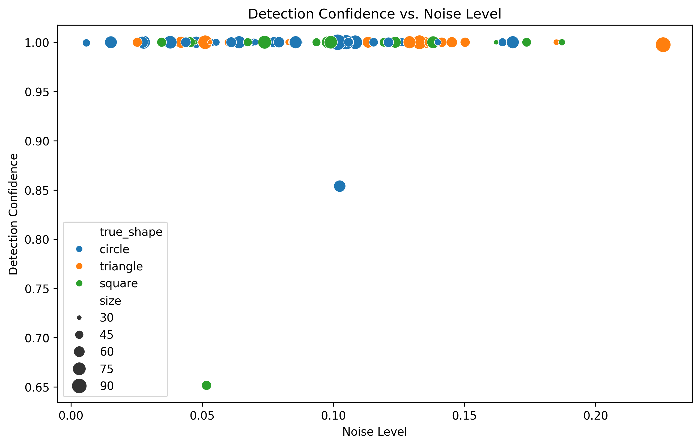
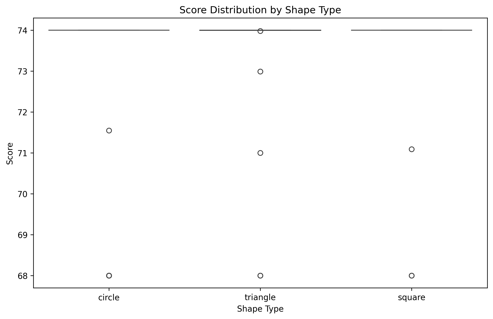

# Report of the project

## 區塊練學習歷程平台

### 1. 技術

- FastAPI (python framework)
- React (javascript framework)
- MongoDB (database)
- TailwindCSS (css framework)

### 2. Demo

- 首頁1

- 首頁2

- 班級管理 (learning metric)

- 班級管理 (teaching case)

- 班級管理 (main page)

- login page (parent)

- login page (teacher)

## 學習成效評估系統

### 1. 技術

- OpenCV
- YoLoV5

### 2. 演算法

[![](https://mermaid.ink/img/pako:eNqNlv1P20YYx_8Vy1W1TgotBEpINO2HQakq9U0N2rQ5_HDYF2Jh-7yzI6CARN8TXppsg7S0rEArCmSjsGndAg30f5lytvNf7Hxng8Oidfkhyvk-33ue-95zjzMlykiBYkrMamhczgFsC0MDGUOgn7RNRxekZmWebM17O8uN-v7w50JHx5fCNcPM29Ilr14jjzbJbs1dWnMPqmS1cmmYS_m3lR8ZxcDMCbcxNDGSoWVJFCIPSs31srey7JYfB7z_YYuy5a9iMCl5R0Wn9NK9f-je2yeHb6kuwvoEQ79SDYAnpcbhApmtk4XKv1blAGMHoIFUC0rNX547lT3y9ANZqQYkNJS2iX976_qtAWhD2VaRIfkjcvTanZ91qq-d2q-RMMHaQRxfwGhne4O8mm9D-wTfAJqAluQu_k5Kleb9OXd5wdloyd-fZ2Q6B0zYrwHfRJYEKTxubryKsKcEE_QjI6sq0JCh5G0X3HfPGh83yMcH1MxP7Dp9bXCoH-kmwKpFt-0P3Ze1Rr1Opc7eEtlfjAQ9jcKDYmRK3pt7pFjl2yaLs2RtLSqgBEOHoG5qwKbZ1Yt-He0vOk-K7t5DZzXqVUgxySAEdh5Tw1hOxQNy_N4plal1EUHIMMENYMs5iZNk4aD5KJo6m2TYHUAPWLqOxuFnloD9Ac3c23kbgRnCD0LV0zLCoasn1tDzcJZrn_KWKlVjVKL3ifJe4QkpLTY356OnGCzP7QSanOcm8WB_rpJygRw_o-KopyEW3h8FsgjvXri7RfePF61XRwnNhMoIkMcken2dQpknQj4cerv77TcRCrhl0ESYNgEu5u2BrP9GfpgLmwAnGHzFUC5I7vuy8_Na2EgyBqfOnxd845b2-NUNWk9LJU-T1Z9oyU8L_SqWNehXhMQftVTLGZFTOWCi9Pd5gLmIP_ovUaNW9LZ-ZLohrDLRyaMW3WkqLbUcLHoSss1ksO6ZmRMzeGE42yvOYcWrVp3nT4OALUc8_XdxM9lJwWnhyoQMNQ0atkQeVt2t2eG2fOJyR1-S8VcRUiSvuEc2j9qjvZ0diR6G3mbNpjTnrNfbo1_08hxu0sr4BuExqbk6S-bWSf2vlhcB3Zaz_YbUS35BHu_wh7Jv-gDMCsGrQciqmpY6l01mY5aN0RhMnevu7g5-d4yrip1Lxc2JM2IFyqpFm3OgHhn53-rIWynW0udjrf0vFlzZMM_oEpHqCRMRY6IOsQ5Uhb5Up3w4I9o5qMOMmKI_FZgFec3OiLHI1Nc0EhjRoOUzU4FzYhYZdlq9Gwhp7lwTTg0CXdUm-eSQqtOGdxOOC3eQDoyM6IMzGWOGZgPyNkpPGrKYsnEexkSM8qM5MZUFmkVHeVOhpzmgAtqe9BCBimojfIP_MWD_D2KiCYzvENJPhHQspqbECTHV05e42H25M56Ix3t6Esme3pg4Kabi8Yvdyb7evnhXsivR2RefiYl3mb5r5h9FVGHl?type=png)](https://mermaid.live/edit#pako:eNqNlv1P20YYx_8Vy1W1TgotBEpINO2HQakq9U0N2rQ5_HDYF2Jh-7yzI6CARN8TXppsg7S0rEArCmSjsGndAg30f5lytvNf7Hxng8Oidfkhyvk-33ue-95zjzMlykiBYkrMamhczgFsC0MDGUOgn7RNRxekZmWebM17O8uN-v7w50JHx5fCNcPM29Ilr14jjzbJbs1dWnMPqmS1cmmYS_m3lR8ZxcDMCbcxNDGSoWVJFCIPSs31srey7JYfB7z_YYuy5a9iMCl5R0Wn9NK9f-je2yeHb6kuwvoEQ79SDYAnpcbhApmtk4XKv1blAGMHoIFUC0rNX547lT3y9ANZqQYkNJS2iX976_qtAWhD2VaRIfkjcvTanZ91qq-d2q-RMMHaQRxfwGhne4O8mm9D-wTfAJqAluQu_k5Kleb9OXd5wdloyd-fZ2Q6B0zYrwHfRJYEKTxubryKsKcEE_QjI6sq0JCh5G0X3HfPGh83yMcH1MxP7Dp9bXCoH-kmwKpFt-0P3Ze1Rr1Opc7eEtlfjAQ9jcKDYmRK3pt7pFjl2yaLs2RtLSqgBEOHoG5qwKbZ1Yt-He0vOk-K7t5DZzXqVUgxySAEdh5Tw1hOxQNy_N4plal1EUHIMMENYMs5iZNk4aD5KJo6m2TYHUAPWLqOxuFnloD9Ac3c23kbgRnCD0LV0zLCoasn1tDzcJZrn_KWKlVjVKL3ifJe4QkpLTY356OnGCzP7QSanOcm8WB_rpJygRw_o-KopyEW3h8FsgjvXri7RfePF61XRwnNhMoIkMcken2dQpknQj4cerv77TcRCrhl0ESYNgEu5u2BrP9GfpgLmwAnGHzFUC5I7vuy8_Na2EgyBqfOnxd845b2-NUNWk9LJU-T1Z9oyU8L_SqWNehXhMQftVTLGZFTOWCi9Pd5gLmIP_ovUaNW9LZ-ZLohrDLRyaMW3WkqLbUcLHoSss1ksO6ZmRMzeGE42yvOYcWrVp3nT4OALUc8_XdxM9lJwWnhyoQMNQ0atkQeVt2t2eG2fOJyR1-S8VcRUiSvuEc2j9qjvZ0diR6G3mbNpjTnrNfbo1_08hxu0sr4BuExqbk6S-bWSf2vlhcB3Zaz_YbUS35BHu_wh7Jv-gDMCsGrQciqmpY6l01mY5aN0RhMnevu7g5-d4yrip1Lxc2JM2IFyqpFm3OgHhn53-rIWynW0udjrf0vFlzZMM_oEpHqCRMRY6IOsQ5Uhb5Up3w4I9o5qMOMmKI_FZgFec3OiLHI1Nc0EhjRoOUzU4FzYhYZdlq9Gwhp7lwTTg0CXdUm-eSQqtOGdxOOC3eQDoyM6IMzGWOGZgPyNkpPGrKYsnEexkSM8qM5MZUFmkVHeVOhpzmgAtqe9BCBimojfIP_MWD_D2KiCYzvENJPhHQspqbECTHV05e42H25M56Ix3t6Esme3pg4Kabi8Yvdyb7evnhXsivR2RefiYl3mb5r5h9FVGHl)

### 3. Demo

- confussion matrix

- noise impact

- score distribution

## 教案生成系統

### 1. 技術

- Ollama
- llama-3.1-70b-versatile

### 2. Demo

#### 教學課程生成

#### 繪圖題目生成

