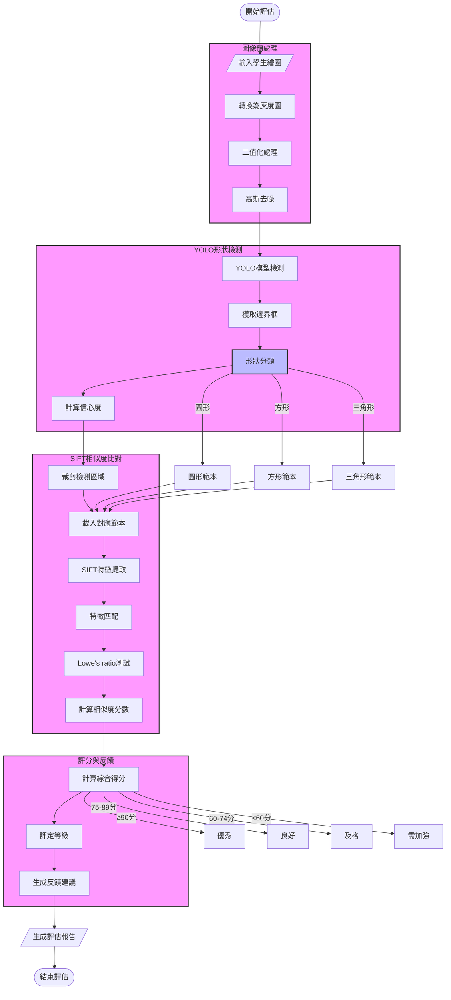

```mermaid
flowchart TD
    Start([開始評估]) --> Input[/輸入學生繪圖/]
    
    subgraph Preprocess[圖像預處理]
        Input --> Gray[轉換為灰度圖]
        Gray --> Binary[二值化處理]
        Binary --> Denoise[高斯去噪]
    end
    
    subgraph YOLODetection[YOLO形狀檢測]
        Denoise --> Detect[YOLO模型檢測]
        Detect --> Boxes[獲取邊界框]
        Boxes --> ShapeClass[形狀分類]
        ShapeClass --> Confidence[計算信心度]
    end
    
    subgraph SIFTComparison[SIFT相似度比對]
        Confidence --> Crop[裁剪檢測區域]
        Crop --> Template[載入對應範本]
        Template --> Features[SIFT特徵提取]
        Features --> Match[特徵匹配]
        Match --> Ratio[Lowe's ratio測試]
        Ratio --> SimScore[計算相似度分數]
    end
    
    subgraph Scoring[評分與反饋]
        SimScore --> Calculate[計算綜合得分]
        Calculate --> Grade[評定等級]
        Grade --> Feedback[生成反饋建議]
    end
    
    Feedback --> Report[/生成評估報告/]
    Report --> End([結束評估])

    %% 分支處理
    ShapeClass -->|圓形| CircleTemp[圓形範本]
    ShapeClass -->|方形| SquareTemp[方形範本]
    ShapeClass -->|三角形| TriTemp[三角形範本]
    CircleTemp --> Template
    SquareTemp --> Template
    TriTemp --> Template

    %% 評分標準說明
    Calculate --> |≥90分| Excellent[優秀]
    Calculate --> |75-89分| Good[良好]
    Calculate --> |60-74分| Pass[及格]
    Calculate --> |<60分| NeedWork[需加強]
    
    %% 樣式定義
    classDef process fill:#f9f,stroke:#333,stroke-width:2px
    classDef decision fill:#bbf,stroke:#333,stroke-width:2px
    class Preprocess,YOLODetection,SIFTComparison,Scoring process
    class ShapeClass decision
```